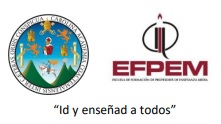

<!DOCTYPE html>
<html>
<head>
	<meta charset="utf-8">
</head>
<body>
	Universidad de San Carlos de Guatemala  
	Escuela de Formación de Profesores de Enseñanza Media - EFPEM  
	Cátedrea de Computación e Informática -  CCI  
	Licenciatura en la Enseñanza de la Informática y la Computación  
	Curso: Didáctica de la Programación      
	
PRÁCTICA BÁSICA DE PHP, GIT Y GITHUB
  
	 
	Carnet: 201122244
	 
	Nombre: Robinson Bernardo Martinez Quevedo
	 
	

	Ejemplos:
	 
	 
	

	<table border="1">
		<tr>
			<th>No.</th>
			<th>Descripción</th>
			<th>Enlace</th>
		</tr>
		<tr>
			<td>1.</td>
			<td>Promedio de 4 números</td>
			<td><a href="promedio.html" target="_blank">Clic para ver ejemplo</a></td>
		</tr>
		<tr>
			<td>2.</td>
			<td>Área de un trapecio</td>
			<td><a href="area.html" target="_blank">Clic para ver ejemplo</a></td>
		</tr>
		<tr>
			<td>3.</td>
			<td>Mayor, Menor y medio de tres números</td>
			<td><a href="mayor.html" target="_blank">Clic para ver ejemplo</a></td>
		</tr>
		<tr>
			<td>4.</td>
			<td>Indicar cuál vocal es la que se repite más veces en un texto</td>
			<td><a href="vocal.html" target="_blank">Clic para ver ejemplo</a></td>
		</tr>
		<tr>
			<td>5.</td>
			<td>Convertir de binario a decimal</td>
			<td><a href="binario.html" target="_blank">Clic para ver ejemplo</a></td>
		</tr>
		<tr>
			<td>6.</td>
			<td>Ordenar de forma ascendente y descendente 20 valores numéricos almacenados en un array</td>
			<td><a href="ordenar.html" target="_blank">Clic para ver ejemplo</a></td>
		</tr>
		<tr>
			<td>7.</td>
			<td>Ejemplo POO - Números pares e Impares</td>
			<td><a href="poo.html" target="_blank">Clic para ver ejemplo</a></td>
		</tr>
	</table>
		
<h1>INTRODUCCIÓN A LA PROGRAMACIÓN ORIENTADA A OBJETOS</h1>

		<ol type="1">
		  <li>POO
			<ol type ="a">
				<li>Clase: Define de manera genérica cómo van a ser los objetos de determinado tipo.</li>
				<li>Objeto:aglutinan toda la funcionalidad relacionada con ellos. </li>
				<li>¿Qué significa instanciar una clase? Consiste en crear un nuevo objeto concreto de la misma. Es decir, un objeto es ya una entidad concreta que se crea a partir de la plantilla que es la clase. </li>
			</ol>
		  </li>
		  <li>Los cuatro pilares de la programación orientada a objetos
			<ol type ="a">
				<li>Encapsulamiento:permite que todo lo referente a un objeto quede aislado dentro de éste. </li>
				<li>Abstracción: el principio de abstracción lo que implica es que la clase debe representar las características de la entidad hacia el mundo exterior, pero ocultando la complejidad que llevan aparejada</li>
				<li>Herencia: cuando una clase hereda de otra obtiene todos los rasgos que tuviese la primera</li>
				<li>Polimorfismo: se refiere al hecho de que varios objetos de diferentes clases, pero con una base común, se pueden usar de manera indistinta, sin tener que saber de qué clase exacta son para poder hacerlo.</li>
			</ol>
		  </li>
		</ol>
<<<<<<< HEAD

=======
>>>>>>> 50b4d76b80c8273e4fc212a99db19f7acb25fb8e
	
	

</body>
</html>
